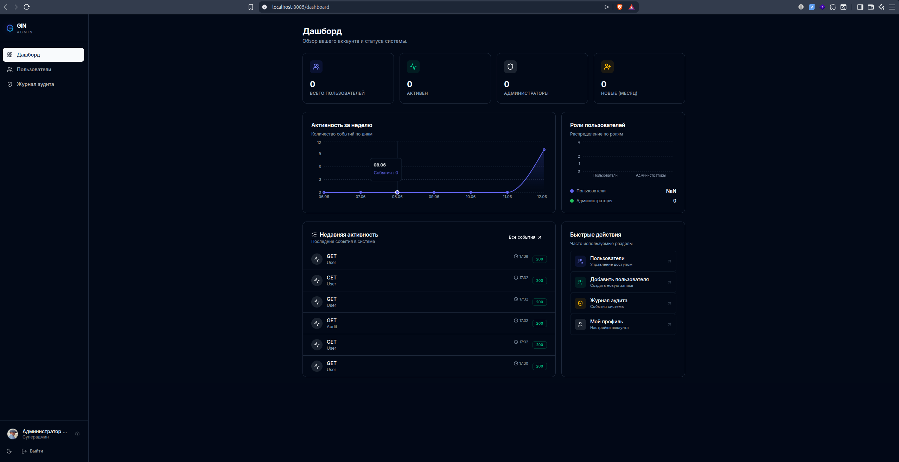
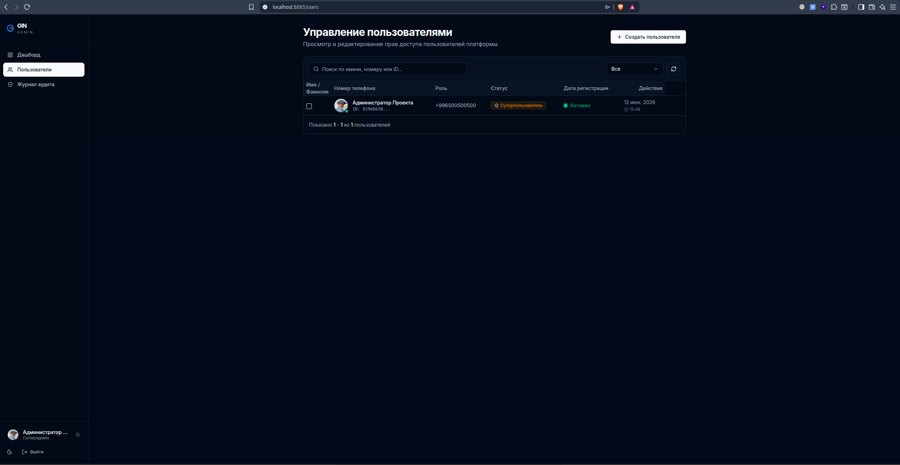
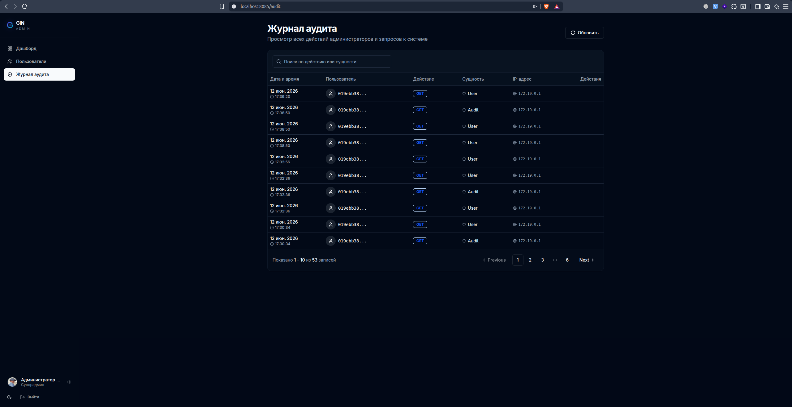

# Gin Admin — Fullstack Admin Panel Template

A production-ready admin panel template built with **Go/Gin** (backend) and **React/TypeScript** (frontend). Designed to be cloned and used as a starting point for any project that needs user management, role-based access control, and an audit trail.

## What's included

| Feature | Details |
|---|---|
| JWT Authentication | Access + refresh token pair, token blacklist via Redis |
| RBAC | Three role levels: `user → admin → superuser` |
| User Management | CRUD, search, avatar upload (MinIO), soft delete |
| Audit Log | Every API action is recorded with user, IP, method, entity |
| File Storage | MinIO (S3-compatible) for avatar uploads |
| Analytics | User stats (total, active, admins, new this month) |
| API Docs | Scalar UI at `/docs` (OpenAPI spec generated by swag) |
| Rate Limiting | Redis-backed login rate limiter |
| Docker | One-command `docker compose up` for full stack |

## Screenshots

**Dashboard** — activity chart, role distribution, recent audit events, quick actions



**Users** — searchable user table with role badges, create/edit/delete



**Audit Log** — paginated log of all system actions with method and entity



## Stack

**Backend:** Go 1.25 · Gin · PostgreSQL 17 · Redis · MinIO · Goose migrations · Swaggo

**Frontend:** React 19 · TypeScript · Vite · Tailwind CSS · shadcn/ui · Zustand · React Query · Recharts · pnpm workspaces

## Quick start (Docker)

```bash
# Clone and enter the project
git clone <repo-url>
cd gin-admin

# Configure environment
cp .env.example .env   # edit secrets as needed

# Start everything
docker compose up --build
```

| Service | URL |
|---|---|
| Frontend | http://localhost:8085 |
| Backend API | http://localhost:8082 |
| API Docs (Scalar) | http://localhost:8082/docs |
| MinIO Console | http://localhost:9001 |

Default superuser credentials are set via `ADMIN_DEFAULT_PHONE` and `ADMIN_DEFAULT_PASSWORD` in `.env`.

## Local development

See [`backend/README.md`](backend/README.md) and [`frontend/README.md`](frontend/README.md) for per-service setup.

## Project layout

```
backend/      Go/Gin REST API (clean architecture)
frontend/     pnpm workspace
  artifacts/
    auth-dashboard/   Main React app
    api-server/       Lightweight API proxy artifact
    mockup-sandbox/   UI component sandbox
  lib/
    api-client-react/ Generated React Query hooks (orval)
    api-spec/         OpenAPI spec source
deploy/       Docker Swarm stack file
docs/screen/  UI screenshots
```

## License

MIT